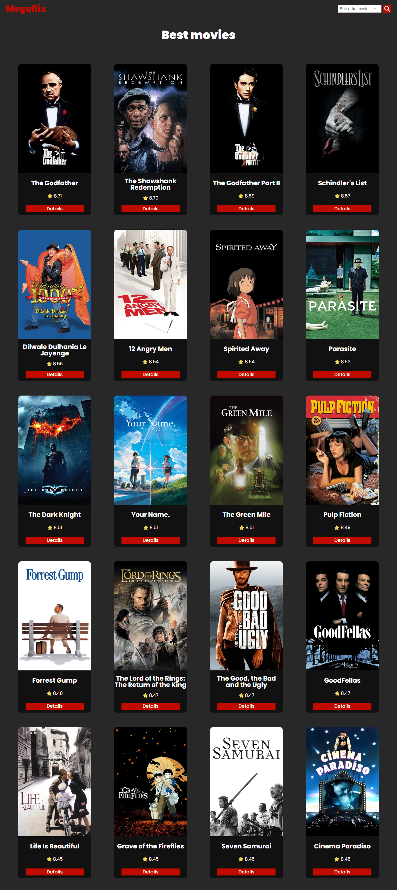

<h1 align="center"> Megaflix </h1>

 

  <a href="#-tecnologias">Tecnologias</a>&nbsp;&nbsp;&nbsp;|&nbsp;&nbsp;&nbsp;
  <a href="#-projeto">Projeto</a>

 

  

## 🚀 Tecnologias

Esse projeto foi desenvolvido com as seguintes tecnologias:

- React.js
- Typescript
- Javascript
- Html e CSS
- Git e Github

## 💻 Projeto

Este é um projeto que consome os dados da API do TMDB e exibe inicialmente uma lista com
os filmes mais bem avaliados, também tem a funcionalidade de pesquisar filmes.

- [Acesse o projeto finalizado, online](https://megaflix-nu.vercel.app/)
